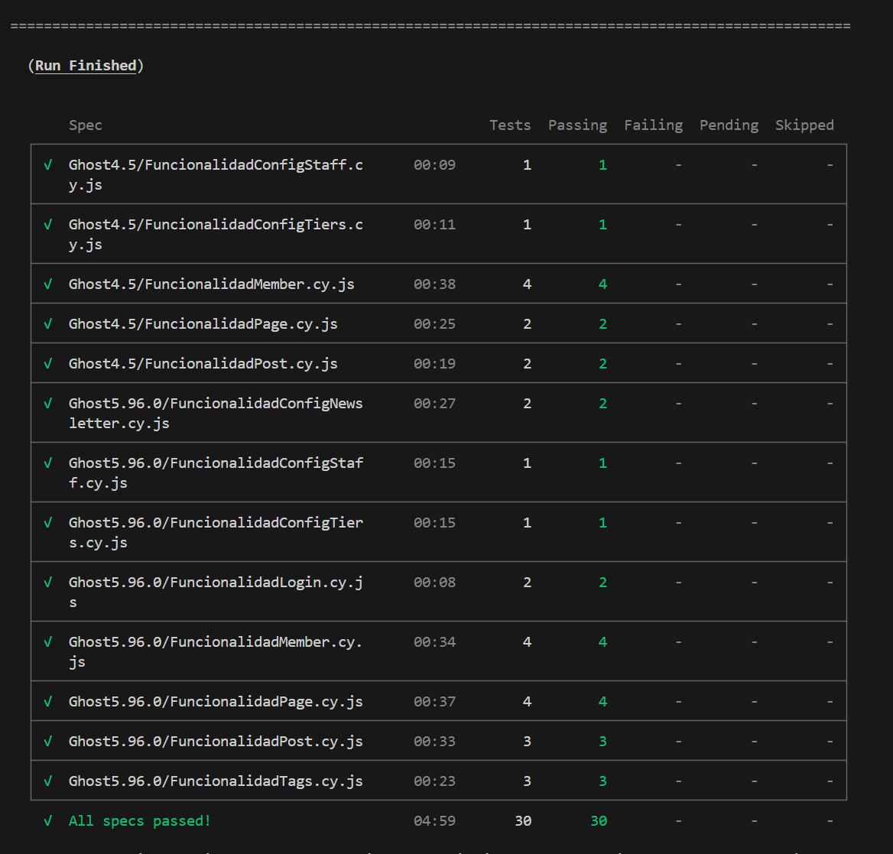

# CypressGhost

**Pruebas realizadas sobre ghost con Cypress:** En este repositorio están los 20 escenarios y pruebas creadas con la herramienta Cypress para las dos aplicaciones

# Requisitos:
* Node
* Ghost
* Docker
# Ambiente donde se comprobó la correcta ejecución:
* SO: _Windows 11_
* Node.js versión: _v20.18.0_
* npm versión: _10.9.0_
# Levantamiento de las imagenes docker de Ghost

## Ghost 5.96.0 (Puerto: 2368)

Para ejecutar Ghost 5.96.0 haciendo uso de docker se pueden correr los siguientes comandos:

```
docker image pull ghost:5.96.0  
docker run -d --name Ghost5.96 -e NODE_ENV=development -e url=http://localhost:2368 -p 2368:2368 ghost:5.96.0
```

Ahora se debe crear el usuario administrador, para ello se debe ingresar a la siguiente url una vez la imagen se haya levantado:

```
http://localhost:2368/ghost/#/setup
```

Y se ingresan los siguientes datos:
* **email:** jd.garciaa1@uniandes.edu.co
* **password:** Pruebas123*

## Ghost 4.5 (Puerto: 3368)

Para ejecutar Ghost 4.5 haciendo uso de docker se pueden correr los siguientes comandos:

```
docker image pull ghost:4.5  
docker run -d --name Ghost4.5 -e NODE_ENV=development -e url=http://localhost:3001 -p 3001:2368 ghost:4.5
```

Ahora se debe crear el usuario administrador, para ello se debe ingresar a la siguiente url una vez la imagen se haya levantado:

```
http://localhost:3001/ghost/#/setup
```

Y se ingresan los siguientes datos:
* **email:** jd.garciaa1@uniandes.edu.co
* **password:** Pruebas123*

## Instalación y ejecución

Una vez hecho lo anterior ya se tiene el back con las dos aplicaciones bajo prueba listas para las pruebas, para ejecutar estas pruebas puede hacer:

1. Instala las dependencias del proyecto, ubicándose en el directorio raíz ejecutamos:

```
npm install
```

2. Por facilidad, se configuro todo para generar las pruebas, comparar la imagenes y generar el reporte haciendo uso de un solo comando:

```
npm run test:comparar
```

Sin embargo, si desea ejecutar solo las pruebas mediante la interfaz de cypress:

```
npx cypress open
```

O si se desea ejecutar sin la interfaz, se ejecuta:

```
npx cypress run --headless
```

Para generar el reporte y la comparacion de manera manual, se puede ejecutar en la raiz del proyecto:

```
node reporte.cjs
```

# Funcionalidades Ghost 5.96.0:
* Funcionalidad ConfigNewsletter
    - E0001 Creando un nuevo newsletter
    - E0002 Editando un newsletter
* Funcionalidad ConfigStaff
    - E0003 Modificación del nombre de usuario
* Funcionalidad ConfigTiers
    - E0004 Modificación tier free
* Funcionalidad Login
    - E0005 Verificando Inicio de sesión exitoso
    - E0006 Verificando inicio de sesión fallido
* Funcionalidad Member
    - E0007 Añadiendo usuario administrativo como miembro
    - E0008 Creando un nuevo miembro
    - E0009 Eliminando un miembro
    - E0010 Eliminando miembro administrador
* Funcionalidad Page
    - E0011 Creando Page con titulo y contenido
    - E0012 Creando Page con titulo y sin contenido
    - E0013 Eliminando una Page
    - E0014 Editando una Page
* Funcionalidad Post
    - E0015 Creando un nuevo post
    - E0016 Eliminando un post
    - E0017 Editando un post
* Funcionalidad Tags
    - E0018 Creando un nuevo Tag
    - E0019 Eliminando un Tag
    - E0020 Editando un Tag
# Funcionalidades Ghost 4.5:
* Funcionalidad ConfigStaff
    - E0001 Modificación del nombre de usuario
* Funcionalidad ConfigTiers
    - E0002 Modificación tier free
* Funcionalidad Member
    - E0003 Añadiendo usuario administrativo como miembro
    - E0004 Creando un nuevo miembro
    - E0005 Eliminando un miembro
    - E0006 Eliminando miembro administrador
* Funcionalidad Page
    - E0007 Creando Page con titulo y contenido
    - E0008 Creando Page con titulo y sin contenido
* Funcionalidad Post
    - E0009 Creando un nuevo post
    - E0010 Eliminando un post
# Pruebas de funcionamiento



# Comparación de imágenes haciendo uso de pixelmatch

La generación del reporte y la comparación de imágenes se realiza automáticamente ejecutando los comandos descritos arriba. Y pueden ser consultados en la carpeta **reporte**.
