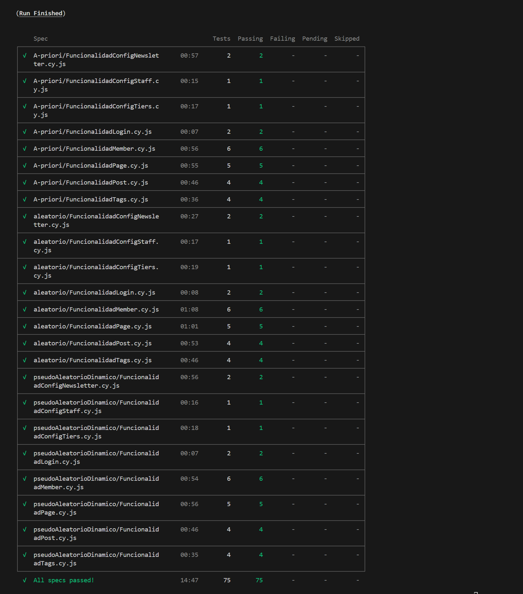

# CypressGhost

**Pruebas realizadas sobre ghost con Cypress:** En este repositorio están los escenarios y pruebas creadas con la herramienta Cypress para la aplicación bajo prueba.

## Requisitos:
* Node
* Ghost
* Docker
## Ambiente donde se comprobó la correcta ejecución:
* SO: _Windows 11_
* Node.js versión: _v20.18.0_
* npm versión: _10.9.0_
## Levantamiento de las imagenes docker de Ghost

#### Ghost 5.96.0 (Puerto: 2368)

Para ejecutar Ghost 5.96.0 haciendo uso de docker se pueden correr los siguientes comandos:

```
docker image pull ghost:5.96.0  
docker run -d --name Ghost5.96 -e NODE_ENV=development -e url=http://localhost:2368 -p 2368:2368 ghost:5.96.0
```

Ahora se debe crear el usuario administrador, para ello se debe ingresar a la siguiente url una vez la imagen se haya levantado:

```
http://localhost:2368/ghost/##/setup
```

Y se ingresan los siguientes datos:
* **email:** jd.garciaa1@uniandes.edu.co
* **password:** Pruebas123*

#### Instalación y ejecución

Una vez hecho lo anterior ya se tiene el back con las dos aplicaciones bajo prueba listas para las pruebas, para ejecutar estas pruebas puede hacer:

1. Instala las dependencias del proyecto, ubicándose en el directorio raíz ejecutamos:

```
npm install
```

Si desea ejecutar solo las pruebas mediante la interfaz de cypress:

```
npx cypress open
```

O si se desea ejecutar sin la interfaz, se ejecuta:

```
npx cypress run --headless
```
## Estrategias de generación de datos

Las estratégicas de generación de datos implementadas en el proyecto son explicadas en la wiki del mismo, para su consulta, seguir el siguiente link [Wiki: Generación de datos](https://github.com/jdanielkc/Semana7/wiki/Estrategias-Datapool)

## Funcionalidades Cypress Ghost 5.96.0:
#### Parte 1:
* Funcionalidad ConfigNewsletter
    - A-priori: FuncionalidadConfigNewsletter - E0001 Creando un nuevo newsletter
    - A-priori: FuncionalidadConfigNewsletter - E0002 Editando un newsletter
* Funcionalidad ConfigStaff
    - A-priori: FuncionalidadConfigStaff - E0003 Modificación del nombre de usuario
* Funcionalidad ConfigTiers
    - A-priori: FuncionalidadConfigTiers - E0004 Modificación tier free
* Funcionalidad Login
    - A-priori: FuncionalidadLogin - E0005 Verificando Inicio de sesión exitoso
    - A-priori: FuncionalidadLogin - E0006 Verificando inicio de sesión fallido
* Funcionalidad Member
    - A-priori: FuncionalidadMember - E0007 Añadiendo usuario administrativo como miembro
    - A-priori: FuncionalidadMember - E0008 Creando un nuevo miembro
    - A-priori: FuncionalidadMember - E0009 Creando un nuevo miembro con email no valido
    - A-priori: FuncionalidadMember - E0010 Creando un nuevo miembro con campo nota mayor a 500 caracteres
    - A-priori: FuncionalidadMember - E0011 Eliminando un miembro
    - A-priori: FuncionalidadMember - E0012 Eliminando miembro administrador
* Funcionalidad Page
    - A-priori: FuncionalidadPage - E0013 Creando Page con titulo y contenido
    - A-priori: FuncionalidadPage - E0014 Creando Page con titulo y sin contenido
    - A-priori: FuncionalidadPage - E0015 Eliminando una Page
    - A-priori: FuncionalidadPage - E0016 Editando una Page
    - A-priori: FuncionalidadPage - E0017 Creando un page con un titulo mayor a 255 caracteres
* Funcionalidad Post
    - A-priori: FuncionalidadPost - E0018 Creando un nuevo post
    - A-priori: FuncionalidadPost - E0019 Eliminando un post
    - A-priori: FuncionalidadPost - E0020 Editando un post
    - A-priori: FuncionalidadPost - E0021 Creando un post con un titulo mayor a 255 caracteres
* Funcionalidad Tags
    - A-priori: FuncionalidadTags - E0022 Creando un nuevo Tag
    - A-priori: FuncionalidadTags - E0023 Eliminando un Tag
    - A-priori: FuncionalidadTags - E0024 Editando un Tag
    - A-priori: FuncionalidadTags - E0025 Creando un tag con una descripción mayor a 500 caracteres

#### Parte 2

* Funcionalidad ConfigNewsletter
    - Aleatorio: FuncionalidadConfigNewsletter - E0001 Creando un nuevo newsletter
    - Aleatorio: FuncionalidadConfigNewsletter - E0002 Editando un newsletter
* Funcionalidad ConfigStaff
    - Aleatorio: FuncionalidadConfigStaff - E0003 Modificación del nombre de usuario
* Funcionalidad ConfigTiers
    - Aleatorio: FuncionalidadConfigTiers - E0004 Modificación tier free
* Funcionalidad Login
    - Aleatorio: FuncionalidadLogin - E0005 Verificando Inicio de sesión exitoso
    - Aleatorio: FuncionalidadLogin - E0006 Verificando inicio de sesión fallido
* Funcionalidad Member
    - Aleatorio: FuncionalidadMember - E0007 Añadiendo usuario administrativo como miembro
    - Aleatorio: FuncionalidadMember - E0008 Creando un nuevo miembro
    - Aleatorio: FuncionalidadMember - E0009 Creando un nuevo miembro con email no valido
    - Aleatorio: FuncionalidadMember - E0010 Creando un nuevo miembro con campo nota mayor a 500 caracteres
    - Aleatorio: FuncionalidadMember - E0011 Eliminando un miembro
    - Aleatorio: FuncionalidadMember - E0012 Eliminando miembro administrador
* Funcionalidad Page
    - Aleatorio: FuncionalidadPage - E0013 Creando Page con titulo y contenido
    - Aleatorio: FuncionalidadPage - E0014 Creando Page con titulo y sin contenido
    - Aleatorio: FuncionalidadPage - E0015 Eliminando una Page
    - Aleatorio: FuncionalidadPage - E0016 Editando una Page
    - Aleatorio: FuncionalidadPage - E0017 Creando un page con un titulo mayor a 255 caracteres
* Funcionalidad Post
    - Aleatorio: FuncionalidadPost - E0018 Creando un nuevo post
    - Aleatorio: FuncionalidadPost - E0019 Eliminando un post
    - Aleatorio: FuncionalidadPost - E0020 Editando un post
    - Aleatorio: FuncionalidadPost - E0021 Creando un post con un titulo mayor a 255 caracteres
* Funcionalidad Tags
    - Aleatorio: FuncionalidadTags - E0022 Creando un nuevo Tag
    - Aleatorio: FuncionalidadTags - E0023 Eliminando un Tag
    - Aleatorio: FuncionalidadTags - E0024 Editando un Tag
    - Aleatorio: FuncionalidadTags - E0025 Creando un tag con una descripción mayor a 500 caracteres

#### Parte 3:
* Funcionalidad ConfigNewsletter
    - pseudo-aleatorio dinámico: FuncionalidadConfigNewsletter - E0001 Creando un nuevo newsletter
    - pseudo-aleatorio dinámico: FuncionalidadConfigNewsletter - E0002 Editando un newsletter
* Funcionalidad ConfigStaff
    - pseudo-aleatorio dinámico: FuncionalidadConfigStaff - E0003 Modificación del nombre de usuario
* Funcionalidad ConfigTiers
    - pseudo-aleatorio dinámico: FuncionalidadConfigTiers - E0004 Modificación tier free
* Funcionalidad Login
    - pseudo-aleatorio dinámico: FuncionalidadLogin - E0005 Verificando Inicio de sesión exitoso
    - pseudo-aleatorio dinámico: FuncionalidadLogin - E0006 Verificando inicio de sesión fallido
* Funcionalidad Member
    - pseudo-aleatorio dinámico: FuncionalidadMember - E0007 Añadiendo usuario administrativo como miembro
    - pseudo-aleatorio dinámico: FuncionalidadMember - E0008 Creando un nuevo miembro
    - pseudo-aleatorio dinámico: FuncionalidadMember - E0009 Creando un nuevo miembro con email no valido
    - pseudo-aleatorio dinámico: FuncionalidadMember - E0010 Creando un nuevo miembro con campo nota mayor a 500 caracteres
    - pseudo-aleatorio dinámico: FuncionalidadMember - E0011 Eliminando un miembro
    - pseudo-aleatorio dinámico: FuncionalidadMember - E0012 Eliminando miembro administrador
* Funcionalidad Page
    - pseudo-aleatorio dinámico: FuncionalidadPage - E0013 Creando Page con titulo y contenido
    - pseudo-aleatorio dinámico: FuncionalidadPage - E0014 Creando Page con titulo y sin contenido
    - pseudo-aleatorio dinámico: FuncionalidadPage - E0015 Eliminando una Page
    - pseudo-aleatorio dinámico: FuncionalidadPage - E0016 Editando una Page
    - pseudo-aleatorio dinámico: FuncionalidadPage - E0017 Creando un page con un titulo mayor a 255 caracteres
* Funcionalidad Post
    - pseudo-aleatorio dinámico: FuncionalidadPost - E0018 Creando un nuevo post
    - pseudo-aleatorio dinámico: FuncionalidadPost - E0019 Eliminando un post
    - pseudo-aleatorio dinámico: FuncionalidadPost - E0020 Editando un post
    - pseudo-aleatorio dinámico: FuncionalidadPost - E0021 Creando un post con un titulo mayor a 255 caracteres
* Funcionalidad Tags
    - pseudo-aleatorio dinámico: FuncionalidadTags - E0022 Creando un nuevo Tag
    - pseudo-aleatorio dinámico: FuncionalidadTags - E0023 Eliminando un Tag
    - pseudo-aleatorio dinámico: FuncionalidadTags - E0024 Editando un Tag
    - pseudo-aleatorio dinámico: FuncionalidadTags - E0025 Creando un tag con una descripción mayor a 500 caracteres
## Pruebas de funcionamiento



# KrakenGhost

**Pruebas realizadas sobre ghost con Kraken:** En este repositorio están los escenarios y pruebas creadas con la herramienta Kraken para la aplicación bajo prueba.

## Requisitos:
* Node
* Ghost
* Docker
## Ambiente donde se comprobó la correcta ejecución:
* SO: _Windows 11_
* Node.js versión: _v20.18.0_
* npm versión: _10.9.0_
## Levantamiento de las imágenes docker de Ghost

El levantamiento de la imagen docker se hace de forma similar a como se realizó en los pasos anteriores con cypress:

```
docker image pull ghost:5.96.0  
docker run -d --name Ghost5.96 -e NODE_ENV=development -e url=http://localhost:2368 -p 2368:2368 ghost:5.96.0
```

Ahora se debe crear el usuario administrador, para ello se debe ingresar a la siguiente url una vez la imagen se haya levantado:

```
http://localhost:2368/ghost/##/setup
```

Y se ingresan los siguientes datos:
* **email:** jd.garciaa1@uniandes.edu.co
* **password:** Pruebas123*

**NOTA:** Si ya se levantaron las imágenes en pasos anteriores, no es necesario ejecutar nuevamente los comandos docker.

#### Instalación y ejecución

Una vez hecho lo anterior ya se tiene el back con la aplicación bajo prueba lista para las pruebas, para ejecutar estas pruebas en kraken debe hacer:

1. Abrir una terminal y moverse a la carpeta interna de kraken en el proyecto:
```
cd kraken
``` 
2. Instalar las dependencias del proyecto, ubicándose en el directorio raíz de kraken, para ello ejecutamos:

```
npm install
```

Para realizar la ejecución de los `.features` se debe mover el `.feature` que se desea ejecutar desde la carpeta `all_features` hacia la raíz de la carpeta `feature`. Por ejemplo, para ejecutar el escenario con el tag `@over_max_title` del feature `prueba0.feature` se debe mover este archivo y posteriormente ejecutar el siguiente comando

```
npx cucumber-js --tags "@over_max_title"
```

## Funcionalidades Kraken Ghost 5.96.0:

De las funcionalidades implementadas en entregas anteriores, se impletaron los pools de datos en los siguientes escenarios y funcionalidades:

* Funcionalidad Page
    - A-priori: `prueba1.feature`
* Funcionalidad Post
    - A-priori: `prueba3.feature`
* Funcionalidad Members
    - A-priori: `prueba5.feature`
* Funcionalidad Login
    - A-priori: `prueba0.feature`
* Funcionalidad Tag
    - Aleatorio: `prueba7.feature`
    - Aleatorio: `prueba9.feature`

El detalle de los escenarios mencionados y el tag necesario para la ejecución están en cada archivo:

* A-priori:

1. prueba1.feature Con mi usuario y contraseña de ghost quiero crear un sitio con el titulo vacío tag: @empty-data

2. prueba3.feature Con mi usuario de ghost quiero crear un post sin datos tag: @empty-data

3. prueba5.feature Con mi usuario de ghost quiero crear un nuevo miembro sin datos a priori tag: @empty_data

4. prueba5.feature Con mi usuario de ghost quiero crear un nuevo miembro con email sin arroba a priori tag: @email_whitout_arroba

5. prueba5.feature Con mi usuario de ghost quiero crear un nuevo miembro con el email sin punto com a priori tag: @email_whitout_dotcom

* Faker:

6. prueba0.feature Login fallido con credenciales aleatorias tag: @faker

7. prueba1.feature Con mi usuario y contraseña de ghost quiero crear un sitio exitosamente con datos aleatorios tag: @success

8. prueba1.feature Con mi usuario y contraseña de ghost quiero crear un sitio con un titulo muy largo tag: @over_max_title

9. prueba3.feature Con mi usuario de ghost quiero crear un post con datos aleatorios tag: @success

10. prueba3.feature Con mi usuario de ghost quiero crear un post con datos aleatorios que superen lo permitido tag: @over_max_title

11. prueba5.feature Con mi usuario de ghost quiero crear un nuevo miembro con datos aleatorios tag: @success

12. prueba5.feature Con mi usuario de ghost quiero crear un nuevo miembro con datos aleatorios y que la nota supere lo permitido tag: @over_max_note

13. prueba7.feature Crear tag exitosamente con datos aleatorios tag: @success

14. prueba7.feature Crear tag error por mas de 191 caracteres en el nombre tag: @over_max_name

15. prueba7.feature Crear tag error con descripción de mas de 500 caracteres tag: @over_max_description

16. prueba9.feature Editar el titulo y la descripción del sitio exitosamente con datos aleatorios tag: @success


# NOTA
Ya que el equipo 24 está conformado solo por 2 integrantes, se cumplió con el requisito de entrega de 60 escenarios en total haciendo uso de los pool de datos a priori, pseudo-aleatorio y aleatorio.